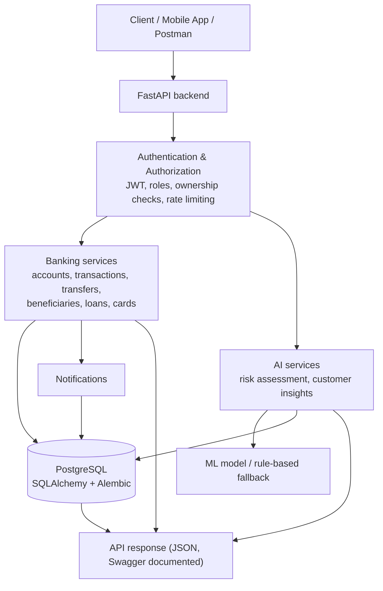
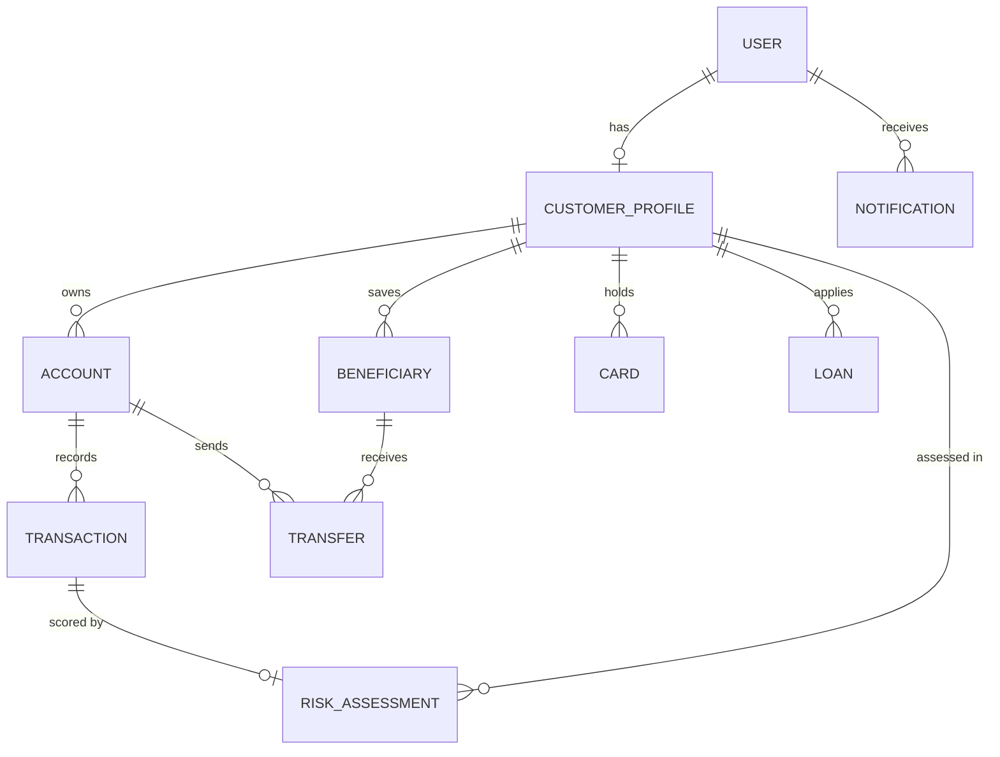

# Architecture

## System overview



## Transaction request flow (AI integrated into the backend)

```mermaid
sequenceDiagram
    participant C as Client
    participant R as Router (validation + auth)
    participant T as Transaction service
    participant A as AI risk service
    participant M as Model (ML or rules)
    participant D as Database
    C->>R: POST /transactions (Bearer token)
    R->>R: Pydantic validation, JWT, ownership, role check
    R->>T: create_transaction()
    T->>D: lock account row, read history
    T->>A: prepare_features() + assess()
    A->>M: predict_score()
    M-->>A: score (validated 0..1; fallback to rules on error)
    A-->>T: risk_score, risk_level, model_version
    T->>D: ONE commit: balance + Transaction + RiskAssessment (+ Notification if HIGH)
    T-->>R: transaction + risk
    R-->>C: 201 {transaction..., risk: {...}}
```

## Layers

| Layer | Folder | Responsibility |
|---|---|---|
| Routers | `app/api/routers/` | HTTP, validation, auth/ownership checks, status codes |
| Dependencies | `app/api/deps.py` | `CurrentUser`, role guards, `ensure_customer_access` |
| Services | `app/services/` | Business rules, atomic DB transactions, AI integration |
| Schemas | `app/schemas/` | Pydantic request/response models (no sensitive fields) |
| Models | `app/models/` | 10 SQLAlchemy entities, constraints, indexes |
| Core | `app/core/` | Config, security (bcrypt, JWT), audit log, rate limit |
| ML | `app/ml/` | Model artifact (optional); `ai_risk_service.py` loads it |

## AI integration

- `AIRiskService.assess()` is the single entry point. The backend owns model loading, input preparation,
  prediction, output validation (0..1, not NaN), version tracking, error handling and prediction logging.
- Model failure or invalid output never blocks a transaction: it falls back to the rule-based model
  (`rules-0.1`), which is recorded as the `model_version`.
- HIGH risk (score >= 0.70): transaction/transfer status `FLAGGED`, funds are held, customer is notified
  and staff review it.
- Model output (`RiskAssessment`, insights) is stored and returned separately from deterministic banking
  records (accounts, transactions, transfers). Insights are labelled `is_model_generated: true`.

## Data model (10 entities)



## Security

- bcrypt password hashing; JWT access (30 min) + stateless refresh tokens (7 days); token type checked.
- Roles CUSTOMER / STAFF / ADMIN; customers only reach their own data (other customers' resources return 404).
- Input validation everywhere; `password_hash` and full card numbers are never returned or stored.
- Login/register rate limiting, CORS allow-list, secrets only in environment variables, audit log lines.
- Production refuses to start with a default or short `SECRET_KEY`.
